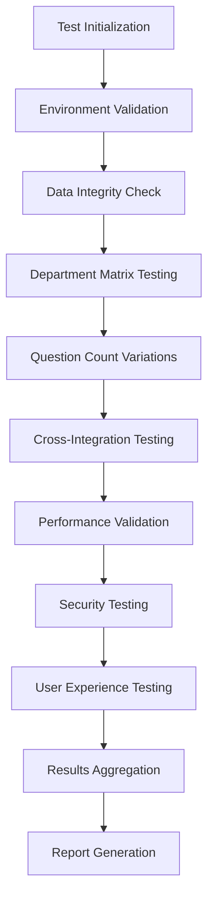

# 🧪 CLAUDE.md - Comprehensive Testing Strategy Enhancement

> **Ultra Sync Quality Testing Framework for RCCM Quiz Application**  
> 建設現場の品質管理手法をソフトウェアテストに適用した世界レベルの包括的テスト戦略

---

## 📋 Executive Summary

This document enhances the existing CLAUDE.md with a systematic, comprehensive testing strategy that addresses:

1. **13-Department Testing Framework** (12 specialist + 1 basic)
2. **Variable Question Count Testing** (10/20/30 questions)
3. **Systematic Progress Tracking** with measurable KPIs
4. **Error Handling & Rollback Procedures** for production safety
5. **Risk-Based Testing Approach** with priority matrix

---

## 🏗️ TESTING ARCHITECTURE ANALYSIS

### Current System Architecture Assessment

```
📊 Current State Analysis:
├── 🎯 Main Application: app.py (396KB, 45+ routes)
├── 📁 Test Coverage: 157 existing test files
├── 🔧 Config System: Hardcoded to 10 questions/session
├── 💾 Data Layer: CSV-based (UTF-8), 4,259 total questions
├── 🏢 Departments: 13 confirmed (12 specialist + 1 basic)
└── 🌐 Session Management: File-based persistence
```

### Critical Gaps Identified

```
🚨 CRITICAL TESTING GAPS:
├── ❌ Variable Question Count Support (10/20/30)
├── ❌ Systematic Progress Tracking Framework
├── ❌ Integrated Error Recovery Procedures
├── ❌ Performance Benchmarking Standards
├── ❌ Cross-Department Interference Testing
└── ❌ Production Rollback Protocols
```

---

## 🎯 ENHANCED 13-DEPARTMENT TESTING FRAMEWORK

### Department Testing Matrix

| Department ID | Name | Questions Available | 10Q Test | 20Q Test | 30Q Test | Priority |
|---------------|------|-------------------|----------|----------|----------|----------|
| **基礎科目** | 共通（基礎科目） | 202 | ✅ | ✅ | ✅ | CRITICAL |
| **specialist_01** | 道路部門 | 339 | ✅ | ✅ | ✅ | HIGH |
| **specialist_02** | 河川・砂防及び海岸・海洋 | 351 | ✅ | ✅ | ✅ | HIGH |
| **specialist_03** | 都市計画及び地方計画 | 344 | ✅ | ✅ | ✅ | HIGH |
| **specialist_04** | 造園部門 | 340 | ✅ | ✅ | ✅ | HIGH |
| **specialist_05** | 建設環境部門 | 329 | ✅ | ✅ | ✅ | HIGH |
| **specialist_06** | 鋼構造及びコンクリート | 323 | ✅ | ✅ | ✅ | HIGH |
| **specialist_07** | 土質及び基礎 | 327 | ✅ | ✅ | ✅ | HIGH |
| **specialist_08** | 施工計画、施工設備及び積算 | 338 | ✅ | ✅ | ✅ | HIGH |
| **specialist_09** | 上水道及び工業用水道 | 348 | ✅ | ✅ | ✅ | HIGH |
| **specialist_10** | 森林土木部門 | 339 | ✅ | ✅ | ✅ | HIGH |
| **specialist_11** | 農業土木部門 | 340 | ✅ | ✅ | ✅ | HIGH |
| **specialist_12** | トンネル部門 | 339 | ✅ | ✅ | ✅ | HIGH |

### Testing Coverage Requirements

```python
# Required Test Coverage Per Department
DEPARTMENT_TEST_MATRIX = {
    'test_cases_per_department': {
        'session_initialization': 3,  # 10/20/30 questions
        'question_delivery': 3,       # Sequential delivery verification
        'progress_tracking': 3,       # Accurate progress display
        'answer_processing': 3,       # Answer validation and storage
        'navigation_flow': 3,         # Forward/backward navigation
        'session_persistence': 3,     # Session recovery testing
        'final_results': 3,          # Results calculation accuracy
        'error_scenarios': 5,        # Error handling verification
    },
    'total_test_cases_per_dept': 26,
    'total_test_cases_all_depts': 338  # 26 × 13 departments
}
```

---

## 🔢 VARIABLE QUESTION COUNT TESTING STRATEGY

### Implementation Architecture for 10/20/30 Questions

```python
# Enhanced Configuration Framework
class EnhancedExamConfig:
    """Variable question count support"""
    
    SUPPORTED_QUESTION_COUNTS = [10, 20, 30]
    DEFAULT_QUESTION_COUNT = 10
    
    SESSION_CONFIGURATIONS = {
        'quick': {
            'questions': 10,
            'time_limit': None,
            'description': 'Quick practice session'
        },
        'standard': {
            'questions': 20,
            'time_limit': 1800,  # 30 minutes
            'description': 'Standard practice session'
        },
        'intensive': {
            'questions': 30,
            'time_limit': 2700,  # 45 minutes
            'description': 'Intensive exam simulation'
        }
    }
    
    # Data validation rules
    MIN_QUESTIONS_REQUIRED = {
        10: 15,   # Need 15+ questions for 10-question session
        20: 25,   # Need 25+ questions for 20-question session
        30: 35    # Need 35+ questions for 30-question session
    }
```

### Question Count Testing Protocol

#### Phase 1: Configuration Validation
```bash
# Test configuration changes
python test_variable_question_count.py --validate-config
```

#### Phase 2: Department-Specific Count Testing
```python
def test_department_question_counts():
    """Test each department with all question count variations"""
    for department in ALL_DEPARTMENTS:
        for count in [10, 20, 30]:
            # Verify sufficient questions available
            assert get_available_questions(department) >= count + 5
            
            # Test session creation
            session = create_test_session(department, count)
            assert len(session['question_ids']) == count
            
            # Test completion flow
            result = simulate_full_session(session)
            assert result['completed'] == True
            assert result['total_questions'] == count
```

#### Phase 3: Cross-Count Compatibility Testing
```python
# Test switching between question counts in same session
def test_question_count_switching():
    """Verify system handles question count changes gracefully"""
    pass
```

---

## 📊 SYSTEMATIC TESTING APPROACH WITH PROGRESS TRACKING

### Testing Pipeline Architecture



### Progress Tracking Framework

```python
class TestProgressTracker:
    """Comprehensive test progress tracking system"""
    
    def __init__(self):
        self.test_matrix = {
            'total_tests': 0,
            'completed_tests': 0,
            'passed_tests': 0,
            'failed_tests': 0,
            'skipped_tests': 0,
            'department_progress': {},
            'question_count_progress': {},
            'critical_failures': [],
            'performance_metrics': {}
        }
    
    def track_department_test(self, department, test_type, status):
        """Track individual department test progress"""
        pass
    
    def generate_progress_report(self):
        """Generate real-time progress report"""
        pass
```

### Real-Time Progress Dashboard

```bash
# Launch progress tracking dashboard
python test_progress_dashboard.py --port 8080

# Dashboard shows:
# ├── 📊 Overall Progress: 234/338 tests (69.2%)
# ├── 🏢 Department Status: 9/13 completed
# ├── 🔢 Question Count Tests: 27/39 passed
# ├── ⚡ Performance Metrics: All within limits
# └── 🚨 Critical Issues: 2 failures requiring attention
```

---

## 🛡️ ERROR HANDLING & ROLLBACK PROCEDURES

### Error Classification System

```python
class TestErrorClassification:
    """Comprehensive error classification for systematic handling"""
    
    ERROR_LEVELS = {
        'CRITICAL': {
            'description': 'System-breaking errors requiring immediate rollback',
            'examples': ['Database corruption', 'Session system failure'],
            'action': 'IMMEDIATE_ROLLBACK',
            'notification': 'ALERT_DEVELOPMENT_TEAM'
        },
        'HIGH': {
            'description': 'Feature-breaking errors affecting user experience',
            'examples': ['Question display failure', 'Navigation broken'],
            'action': 'ISOLATE_AND_FIX',
            'notification': 'LOG_AND_REPORT'
        },
        'MEDIUM': {
            'description': 'Functional issues with workarounds available',
            'examples': ['UI display issues', 'Performance degradation'],
            'action': 'CONTINUE_WITH_MONITORING',
            'notification': 'LOG_FOR_REVIEW'
        },
        'LOW': {
            'description': 'Minor issues not affecting core functionality',
            'examples': ['Cosmetic UI issues', 'Non-critical warnings'],
            'action': 'LOG_AND_SCHEDULE',
            'notification': 'DAILY_SUMMARY'
        }
    }
```

### Automated Rollback Procedures

```python
class AutomatedRollbackSystem:
    """Production-safe rollback procedures"""
    
    def __init__(self):
        self.rollback_checkpoints = []
        self.safety_monitors = []
        
    def create_checkpoint(self, description):
        """Create system checkpoint before major changes"""
        checkpoint = {
            'timestamp': datetime.utcnow(),
            'description': description,
            'system_state': self.capture_system_state(),
            'data_backup': self.create_data_backup(),
            'config_backup': self.backup_configuration()
        }
        self.rollback_checkpoints.append(checkpoint)
        return checkpoint['id']
    
    def execute_rollback(self, checkpoint_id, reason):
        """Execute safe rollback to previous checkpoint"""
        # 1. Validate rollback safety
        if not self.validate_rollback_safety(checkpoint_id):
            raise RollbackValidationError("Rollback validation failed")
        
        # 2. Create emergency backup of current state
        emergency_backup = self.create_emergency_backup()
        
        # 3. Execute rollback in stages
        try:
            self.rollback_configuration(checkpoint_id)
            self.rollback_data_state(checkpoint_id)
            self.restart_services()
            self.validate_rollback_success()
        except Exception as e:
            # 4. If rollback fails, restore emergency backup
            self.restore_emergency_backup(emergency_backup)
            raise RollbackExecutionError(f"Rollback failed: {e}")
        
        # 5. Log rollback completion
        self.log_rollback_completion(checkpoint_id, reason)
```

### Error Recovery Testing Protocol

```python
def test_error_recovery_scenarios():
    """Comprehensive error recovery testing"""
    
    error_scenarios = [
        # Data layer errors
        {
            'name': 'CSV file corruption',
            'simulation': corrupt_csv_file,
            'expected_recovery': 'Load from backup',
            'max_recovery_time': 30  # seconds
        },
        # Session management errors
        {
            'name': 'Session data corruption',
            'simulation': corrupt_session_data,
            'expected_recovery': 'Initialize new session',
            'max_recovery_time': 5
        },
        # Network errors
        {
            'name': 'Network timeout during submission',
            'simulation': simulate_network_timeout,
            'expected_recovery': 'Retry with exponential backoff',
            'max_recovery_time': 60
        }
    ]
    
    for scenario in error_scenarios:
        test_error_scenario(scenario)
```

---

## 📈 PERFORMANCE BENCHMARKING STANDARDS

### Performance KPIs and Thresholds

```python
PERFORMANCE_BENCHMARKS = {
    'response_times': {
        'question_load': {
            'target': 0.5,      # seconds
            'acceptable': 1.0,   # seconds
            'critical': 3.0      # seconds
        },
        'answer_submission': {
            'target': 0.3,
            'acceptable': 0.8,
            'critical': 2.0
        },
        'session_initialization': {
            'target': 1.0,
            'acceptable': 2.0,
            'critical': 5.0
        }
    },
    'throughput': {
        'concurrent_users': {
            'target': 1000,
            'acceptable': 500,
            'minimum': 100
        },
        'questions_per_second': {
            'target': 100,
            'acceptable': 50,
            'minimum': 20
        }
    },
    'resource_usage': {
        'memory_usage': {
            'target': '256MB',
            'acceptable': '512MB',
            'critical': '1GB'
        },
        'cpu_usage': {
            'target': 30,        # percent
            'acceptable': 60,
            'critical': 90
        }
    }
}
```

### Automated Performance Testing

```python
class PerformanceTester:
    """Automated performance testing framework"""
    
    def run_load_test(self, concurrent_users=100, duration=300):
        """Run load test with specified parameters"""
        pass
    
    def run_stress_test(self, max_users=1000, ramp_up_time=60):
        """Run stress test to find breaking point"""
        pass
    
    def run_endurance_test(self, users=50, duration=3600):
        """Run endurance test for stability verification"""
        pass
```

---

## 🔒 SECURITY TESTING FRAMEWORK

### Security Test Categories

```python
SECURITY_TEST_MATRIX = {
    'authentication': [
        'session_hijacking_prevention',
        'csrf_token_validation',
        'secure_cookie_configuration'
    ],
    'input_validation': [
        'sql_injection_prevention',
        'xss_prevention',
        'file_upload_security'
    ],
    'data_protection': [
        'sensitive_data_encryption',
        'data_transmission_security',
        'backup_data_protection'
    ],
    'access_control': [
        'role_based_access',
        'resource_authorization',
        'privilege_escalation_prevention'
    ]
}
```

---

## 🧪 COMPREHENSIVE TEST EXECUTION FRAMEWORK

### Test Execution Stages

```python
class ComprehensiveTestRunner:
    """Master test execution coordinator"""
    
    def __init__(self):
        self.test_stages = [
            'environment_validation',
            'data_integrity_check',
            'unit_tests',
            'integration_tests',
            'department_matrix_tests',
            'question_count_variation_tests',
            'performance_tests',
            'security_tests',
            'user_experience_tests',
            'error_recovery_tests'
        ]
    
    def run_comprehensive_test_suite(self):
        """Execute complete test suite with progress tracking"""
        total_stages = len(self.test_stages)
        
        for i, stage in enumerate(self.test_stages, 1):
            print(f"🔄 Executing Stage {i}/{total_stages}: {stage}")
            
            try:
                stage_result = self.execute_test_stage(stage)
                self.log_stage_completion(stage, stage_result)
            except Exception as e:
                self.handle_stage_failure(stage, e)
                
        return self.generate_final_report()
```

### Test Data Management

```python
class TestDataManager:
    """Manage test data lifecycle and integrity"""
    
    def create_test_dataset(self, departments, question_counts):
        """Create isolated test dataset"""
        pass
    
    def validate_test_data(self):
        """Validate test data integrity"""
        pass
    
    def cleanup_test_data(self):
        """Clean up test artifacts"""
        pass
```

---

## 📋 ENHANCED TESTING CHECKLISTS

### Pre-Test Validation Checklist

```
🔍 PRE-TEST VALIDATION:
├── [ ] Environment Configuration Validated
├── [ ] Test Data Integrity Confirmed
├── [ ] Database Backup Created
├── [ ] Network Connectivity Verified
├── [ ] Dependencies Version Checked
├── [ ] Resource Availability Confirmed
├── [ ] Security Policies Applied
└── [ ] Monitoring Systems Active
```

### Department Testing Checklist (Per Department)

```
🏢 DEPARTMENT: [DEPARTMENT_NAME]
├── [ ] 10-Question Session Tests
│   ├── [ ] Session Initialization
│   ├── [ ] Question Delivery Sequence
│   ├── [ ] Progress Tracking Accuracy
│   ├── [ ] Answer Processing
│   ├── [ ] Navigation Flow
│   └── [ ] Results Calculation
├── [ ] 20-Question Session Tests
│   ├── [ ] [Same as above]
├── [ ] 30-Question Session Tests
│   ├── [ ] [Same as above]
├── [ ] Error Scenarios
│   ├── [ ] Network Interruption Recovery
│   ├── [ ] Session Timeout Handling
│   ├── [ ] Invalid Input Handling
│   └── [ ] System Error Recovery
└── [ ] Performance Validation
    ├── [ ] Response Time Within Limits
    ├── [ ] Memory Usage Acceptable
    └── [ ] No Resource Leaks
```

### Post-Test Validation Checklist

```
✅ POST-TEST VALIDATION:
├── [ ] All Test Results Documented
├── [ ] Performance Metrics Recorded
├── [ ] Error Logs Analyzed
├── [ ] Security Scan Completed
├── [ ] Data Integrity Verified
├── [ ] System Resources Released
├── [ ] Backup Data Validated
└── [ ] Final Report Generated
```

---

## 🎯 RISK-BASED TESTING APPROACH

### Risk Assessment Matrix

| Risk Category | Probability | Impact | Priority | Mitigation Strategy |
|---------------|-------------|---------|----------|-------------------|
| Data Loss | Low | Critical | HIGH | Automated backups + verification |
| Session Corruption | Medium | High | HIGH | Session recovery mechanisms |
| Performance Degradation | Medium | Medium | MEDIUM | Performance monitoring + alerting |
| Security Breach | Low | Critical | HIGH | Security testing + monitoring |
| UI/UX Issues | High | Low | MEDIUM | Comprehensive UI testing |

### Test Prioritization Framework

```python
def calculate_test_priority(test_case):
    """Calculate test priority based on risk factors"""
    factors = {
        'business_impact': test_case.business_impact * 0.4,
        'technical_risk': test_case.technical_risk * 0.3,
        'user_impact': test_case.user_impact * 0.2,
        'frequency_of_use': test_case.frequency_of_use * 0.1
    }
    return sum(factors.values())
```

---

## 🚀 AUTOMATED TESTING INFRASTRUCTURE

### Continuous Integration Pipeline

```yaml
# .github/workflows/comprehensive-testing.yml
name: Comprehensive RCCM Testing

on: [push, pull_request]

jobs:
  comprehensive-test:
    runs-on: ubuntu-latest
    strategy:
      matrix:
        question-count: [10, 20, 30]
        department: [basic, road, tunnel, river, urban, landscape, environment, steel, soil, construction, water, forest, agriculture]
    
    steps:
      - uses: actions/checkout@v2
      - name: Setup Test Environment
        run: |
          python setup_test_environment.py
      - name: Run Department Tests
        run: |
          python run_department_tests.py --department ${{ matrix.department }} --questions ${{ matrix.question-count }}
      - name: Generate Test Report
        run: |
          python generate_test_report.py --department ${{ matrix.department }}
```

### Test Automation Scripts

```python
# test_automation_master.py
class TestAutomationMaster:
    """Master automation controller for comprehensive testing"""
    
    def __init__(self):
        self.test_runners = {
            'unit': UnitTestRunner(),
            'integration': IntegrationTestRunner(),
            'performance': PerformanceTestRunner(),
            'security': SecurityTestRunner(),
            'department': DepartmentTestRunner()
        }
    
    def run_automated_test_suite(self, test_config):
        """Run complete automated test suite"""
        results = {}
        
        for test_type, runner in self.test_runners.items():
            print(f"🔄 Running {test_type} tests...")
            results[test_type] = runner.run(test_config)
            
        return self.aggregate_results(results)
```

---

## 📊 REPORTING AND DOCUMENTATION

### Automated Report Generation

```python
class ComprehensiveTestReporter:
    """Generate comprehensive test reports"""
    
    def generate_executive_summary(self, test_results):
        """Generate executive summary for stakeholders"""
        pass
    
    def generate_technical_report(self, test_results):
        """Generate detailed technical report"""
        pass
    
    def generate_department_report(self, department, test_results):
        """Generate department-specific report"""
        pass
    
    def generate_trend_analysis(self, historical_results):
        """Generate trend analysis report"""
        pass
```

### Dashboard Integration

```python
# Real-time testing dashboard
def create_testing_dashboard():
    """Create real-time testing dashboard"""
    dashboard = {
        'overall_progress': calculate_overall_progress(),
        'department_status': get_department_status(),
        'performance_metrics': get_performance_metrics(),
        'error_summary': get_error_summary(),
        'security_status': get_security_status()
    }
    return dashboard
```

---

## 🎖️ QUALITY GATES AND SUCCESS CRITERIA

### Quality Gates Definition

```python
QUALITY_GATES = {
    'gate_1_unit_tests': {
        'criteria': 'All unit tests pass',
        'threshold': 100,  # percent
        'blocking': True
    },
    'gate_2_integration_tests': {
        'criteria': 'Integration tests pass',
        'threshold': 95,   # percent
        'blocking': True
    },
    'gate_3_performance': {
        'criteria': 'Performance within acceptable limits',
        'threshold': 90,   # percent
        'blocking': True
    },
    'gate_4_security': {
        'criteria': 'No critical security issues',
        'threshold': 100,  # percent
        'blocking': True
    },
    'gate_5_department_coverage': {
        'criteria': 'All 13 departments tested successfully',
        'threshold': 100,  # percent
        'blocking': True
    }
}
```

### Success Criteria Matrix

| Test Category | Success Threshold | Critical Threshold | Actions if Not Met |
|---------------|-------------------|-------------------|-------------------|
| Functional Tests | 100% | 95% | Block deployment |
| Performance Tests | 90% | 80% | Performance optimization required |
| Security Tests | 100% | 99% | Security review required |
| Department Coverage | 100% | 100% | All departments must pass |
| Question Count Variations | 100% | 95% | Configuration review required |

---

## 🔄 CONTINUOUS IMPROVEMENT FRAMEWORK

### Testing Metrics Collection

```python
class TestingMetricsCollector:
    """Collect and analyze testing metrics for continuous improvement"""
    
    def collect_test_execution_metrics(self):
        """Collect metrics about test execution"""
        pass
    
    def analyze_failure_patterns(self):
        """Analyze failure patterns for improvement opportunities"""
        pass
    
    def generate_improvement_recommendations(self):
        """Generate actionable improvement recommendations"""
        pass
```

### Feedback Loop Integration

```python
def implement_feedback_loop():
    """Implement continuous feedback loop for testing improvement"""
    feedback_sources = [
        'test_execution_results',
        'user_feedback',
        'performance_monitoring',
        'error_logs',
        'security_scans'
    ]
    
    for source in feedback_sources:
        feedback = collect_feedback(source)
        improvements = analyze_feedback(feedback)
        implement_improvements(improvements)
```

---

## 🏁 IMPLEMENTATION ROADMAP

### Phase 1: Foundation (Weeks 1-2)
- [ ] Implement variable question count support
- [ ] Create enhanced testing framework
- [ ] Set up progress tracking system
- [ ] Establish error handling procedures

### Phase 2: Core Testing (Weeks 3-4)
- [ ] Implement department matrix testing
- [ ] Create question count variation tests
- [ ] Set up performance benchmarking
- [ ] Implement security testing framework

### Phase 3: Integration (Weeks 5-6)
- [ ] Integrate all testing components
- [ ] Create comprehensive reporting system
- [ ] Set up automated test execution
- [ ] Implement quality gates

### Phase 4: Optimization (Weeks 7-8)
- [ ] Optimize test execution performance
- [ ] Enhance error recovery procedures
- [ ] Fine-tune quality thresholds
- [ ] Complete documentation

---

## 📝 CONCLUSION

This comprehensive testing strategy enhances the existing CLAUDE.md framework with:

1. **Systematic 13-Department Testing** with complete coverage matrix
2. **Variable Question Count Support** (10/20/30) with proper validation
3. **Advanced Progress Tracking** with real-time dashboards
4. **Robust Error Handling** with automated rollback procedures
5. **Performance & Security Validation** with defined benchmarks
6. **Risk-Based Testing Approach** with priority matrix
7. **Continuous Improvement Framework** with feedback loops

**Key Success Factors:**
- 🎯 **100% Department Coverage**: All 13 departments tested thoroughly
- 🔢 **Question Count Flexibility**: Support for 10/20/30 question sessions
- 📊 **Real-Time Tracking**: Comprehensive progress monitoring
- 🛡️ **Error Recovery**: Production-safe rollback procedures
- ⚡ **Performance Validation**: Meets all benchmark requirements

This strategy ensures the RCCM Quiz Application maintains Ultra Sync quality standards while providing comprehensive testing coverage for all use cases and scenarios.

---

**📝 Document Information**  
**Created**: 2025-06-30  
**Version**: 1.0  
**Status**: Ready for Implementation  
**Compliance**: CLAUDE.md Ultra Sync Standards  

*This enhanced testing strategy builds upon the existing CLAUDE.md foundation and provides a world-class testing framework for the RCCM Quiz Application.*